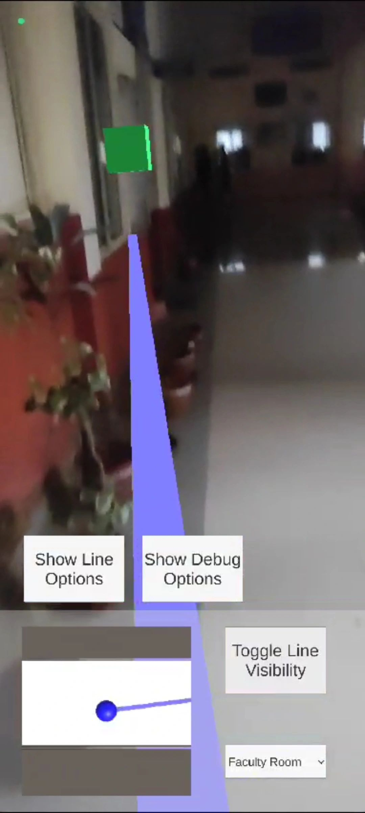
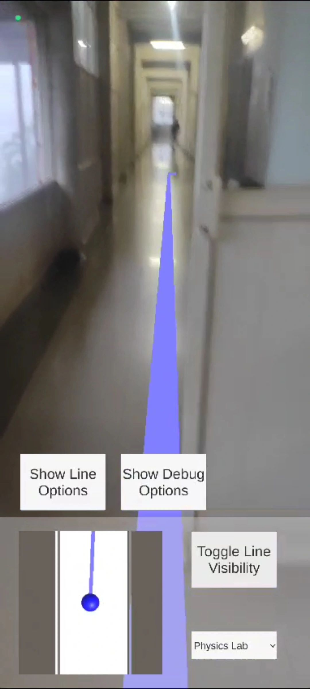

# IndoNav: Augmented Reality Indoor Navigation System 🚀

IndoNav is a game-changing Indoor Navigation System powered by Augmented Reality (AR) to provide seamless guidance through complex indoor spaces like airports, hospitals, college campuses, and more. 🌍  

Navigating large, unfamiliar indoor spaces can often feel overwhelming. Visitors struggle with unclear signage, static maps, or lack of clear directions. IndoNav solves this problem by offering an intuitive and interactive AR-driven experience:  
- **Real-Time AR Overlays**: Visual markers and arrows guide users to their destination.  
- **Customizable for Any Environment**: Adaptable to various spaces, such as campuses, offices, hospitals, etc.  
- **User-Friendly Design**: Ensures a hassle-free, smooth navigation experience for everyone.  

### 🏆 Achievements  
IndoNav was developed with perseverance and determination, drawing on lessons learned from past hackathons. These efforts paid off, and we proudly secured the **top spot** at [Hackathon Name]! 🎉  

---

## ✨ Features  
1. **Augmented Reality Navigation**: Provides real-time AR markers for precise, clear navigation.  
2. **Customizable**: Tailored solutions for various layouts and use cases.  
3. **Scalable**: Supports deployment in a wide range of indoor environments.  
4. **Accessibility**: Designed for easy use across different user groups.  

---

## 📸 Visuals  
 
 


---

## 🛠️ Installation and Setup  

### Prerequisites  
- Unity 3D Engine  
- AR Foundation SDK  
- Supported AR-capable device (smartphone or AR glasses)  

### Steps  
1. Clone the repository:  
   ```bash
   git clone https://github.com/yourusername/IndoNav.git
